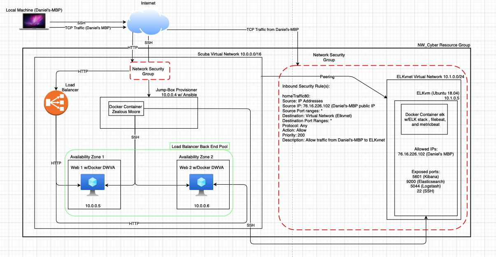
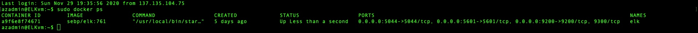

## Automated ELK Stack Deployment

The files in this repository were used to configure the network depicted below.

These files have been tested and used to generate a live ELK deployment on Azure. They can be used to either recreate the entire deployment pictured above. Alternatively, select portions of the playbook file may be used to install only certain pieces of it, such as Filebeat.

---
- name: install elk
  hosts: elk
  become: true
  tasks:
    - name: Install docker.io
      apt:
        force_apt_get: yes
        name: docker.io
        state: present
        update_cache: yes

    - name: Install python3-pip
      apt:
        force_apt_get: yes
        name: python3-pip
        state: present

    - name: Install Docker Module
      pip:
        name: docker
        state: present

    - name: Increase virtual mem
      command: sysctl -w vm.max_map_count=262144

    - name: Use more mem
      sysctl:
        name: vm.max_map_count
        reload: yes
        state: present
        value: '262144'

    - name: download and launch docker elk container
      docker_container:
        name: elk
        image: sebp/elk:761
        state: started
        restart_policy: always
        published_ports:
          - 5601:5601
          - 9200:9200
          - 5044:5044

This document contains the following details:
- Description of the Topologu
- Access Policies
- ELK Configuration
  - Beats in Use
  - Machines Being Monitored
- How to Use the Ansible Build

### Description of the Topology

The main purpose of this network is to expose a load-balanced and monitored instance of DVWA, the D*mn Vulnerable Web Application.

Load balancing ensures that the application will be highly availble, in addition to restricting access to the network.
- _What aspect of security do load balancers protect? What is the advantage of a jump box?_
    Load balancers do exactly what they are named as: balance the incoming traffic and distribute it amongst the resources it is assigned to. They protect the availability of our assets, in this case the webservers. By distributing requests between the servers, we can ensure that these servers won't be inundated with requests that may take them offline. 

Integrating an ELK server allows users to easily monitor the vulnerable VMs for changes to the logs and system traffic.
- _TODO: What does Filebeat watch for?_
   - Log and file locations, and collects log events.
- _TODO: What does Metricbeat record?_
   - Gathers metric and statistical data from OS and services.

The configuration details of each machine may be found below.
_Note: Use the [Markdown Table Generator](http://www.tablesgenerator.com/markdown_tables) to add/remove values from the table_.

|         Name         | Function       | IP Address | Operating System   |
|:--------------------:|----------------|------------|--------------------|
| Jump-Box Provisioner | Gateway        | 10.0.0.4   | Linux Ubuntu 18.04 |
| Web 1                | DVWA Server    | 10.0.0.5   | Linux Ubuntu 18.04 |
| Web 2                | DVWA Server    | 10.0.0.6   | Linux Ubuntu 18.04 |
| ELKvm                | ELK Stack Host | 10.1.0.5   | Linux Ubuntu 18.04 |

### Access Policies

The machines on the internal network are not exposed to the public Internet. 

Only the Jump-Box Provisioner machine can accept connections from the Internet. Access to this machine is only allowed from the following IP addresses:
- _TODO: Add whitelisted IP addresses_

Machines within the network can only be accessed by _____.
- _TODO: Which machine did you allow to access your ELK VM? What was its IP address?_

A summary of the access policies in place can be found in the table below.

|         Name         | Publicly Accessible | Allowed IP Address |
|:--------------------:|:-------------------:|:------------------:|
| Jump-Box Provisioner |         Yes         |    76.16.226.102   |
|         Web 1        |          No         |      10.0.0.4      |
|         Web 2        |     DVWA Server     |      10.0.0.4      |
|         ELKvm        |    ELK Stack Host   |      10.0.0.4      |

### Elk Configuration

Ansible was used to automate configuration of the ELK machine. No configuration was performed manually, which is advantageous because...
- _What is the main advantage of automating configuration with Ansible?_
   - When using Ansible playbooks, your solution becomes scalable and ensures consistency across multiple machines. Since the configuration is automated from one playbook, you can deploy as many as you need to quickly with no error (so long as your playbook is written correctly.)

The playbook implements the following tasks:
- _In 3-5 bullets, explain the steps of the ELK installation play. E.g., install Docker; download image; etc._
- ... First: docker.io is installed via apt-get 
- ... Second: python3-pip is installed via apt-get
- ... Third: Docker Module is installed via pip
- ... Fourth: Virtual Memory is increased via command and then using systctl, I made the machine use that increased virtual memory
- ... Fifth: Docker elk container is installed and launched

The following screenshot displays the result of running `docker ps` after successfully configuring the ELK instance.

### Target Machines & Beats
This ELK server is configured to monitor the following machines:
- _List the IP addresses of the machines you are monitoring_
  Web 1 10.0.0.5
  Web 2 10.0.0.6

We have installed the following Beats on these machines:
- _TODO: Specify which Beats you successfully installed_
  Metricbeat
  Filebeat

These Beats allow us to collect the following information from each machine:
- _TODO: In 1-2 sentences, explain what kind of data each beat collects, and provide 1 example of what you expect to see. E.g., `Winlogbeat` collects Windows logs, which we use to track user logon events, etc._
  Metricbeat - Collects information about services that are running. E.g. We can use track system to monitor CPU usage, memory usage, and inbound traffic.
  Filebeat - Collects and centralizes log files. You can use these log files to view events that have been logged on the servers we are monitoring.

### Using the Playbook
In order to use the playbook, you will need to have an Ansible control node already configured. Assuming you have such a control node provisioned: 

SSH into the control node and follow the steps below:
- Copy the YAML file to roles.
- Update the hosts file to include the Webserver group and their IPs. 
- Run the playbook, and navigate to Kibana on your browser to check that the installation worked as expected.

_TODO: Answer the following questions to fill in the blanks:_
- _Which file is the playbook? Where do you copy it?_
  - filebeat-playbook.yml, copied to roles
- _Which file do you update to make Ansible run the playbook on a specific machine? How do I specify which machine to install the ELK server on versus which to install Filebeat on?_
  - Update the hosts file in /etc/ansible. I specified the installation using groups e.g webservers or elk.
- _Which URL do you navigate to in order to check that the ELK server is running?
  - http://<ELKvm Public IP>:5601/app/kibana

_As a **Bonus**, provide the specific commands the user will need to run to download the playbook, update the files, etc._
